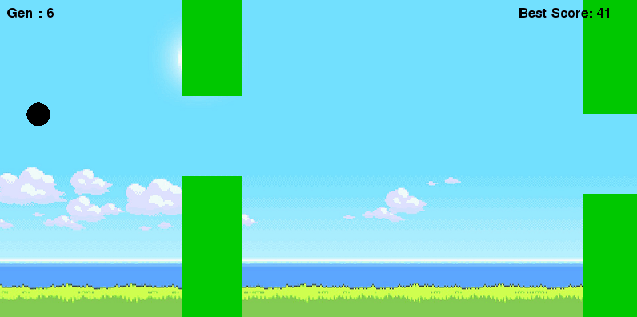
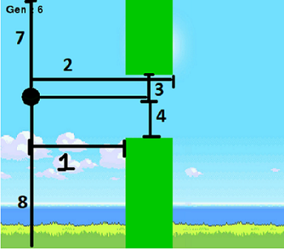

  

<h1 align="center">flappybirdAI</h1>

	

<h4 align="center">Flappy Bird game, but AI plays it</h4>

<h2> How it works</h2>

There are 8 inputs to neural network

<ol>
					<li><h5>horizontal distance from the start of pipe</h5></li>
					<li><h5>horizontal distance from the end of pipe</h5></li>
					<li><h5>vertical distance from the upper pipe</h5></li>
					<li><h5>vertical distance from the lower pipe</h5></li>
					<li><h5>y position of bird</h5></li>
					<li><h5>y velocity of bird</h5></li>
					<li><h5>vertical distance from sky</h5></li>
					<li><h5>vertical distance from ground</h5></li>
				</ol>

For detailed explanation, visit my <a href="https://sushantpatrikar.github.io/flappybirdAI.html"> website</a>.

<h2>Future Scope</h2>

Right now, the algorithm used is NEAT. Some other Reinforcement Learning algorithm, such as Deep Q-Learning can be applied to it. If you have any other ideas, Pull Requests are welcomed!

        

